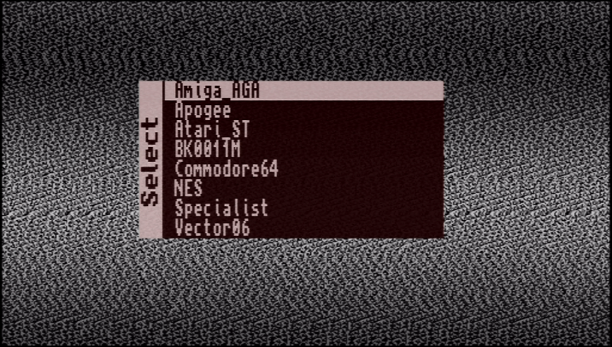

# Core de inicio que muestra un menú

Obtenido desde [el repositorio oficial de MiST](https://github.com/mist-devel/mist-binaries/tree/master/cores/menu), sintetizado con Quartus 17.1 (usando Wine en macOS), aplicando antes el script [mist2sidi.sh](../src/README.md#misttosidi.sh).

## Uso

copiar el archivo `menu.rbf` a la raiz de la tarjeta SD, pero con el nombre `core.rbf`.

### Imagen de fondo

Se puede añadir un archivo BMP, de 512x312 pixeles y 32-bit de color, que se usará como imagen de fondo. Renombrarlo como `MENU.ROM` y copiar a la raiz de la tarjeta SD. Además, notar que la imagen se muestra con una proporción 4:3, por lo que se tendrá que ajustar el archivo (proporción 16:10) de forma adecuada para que la imagen no se vea distorsionada.
